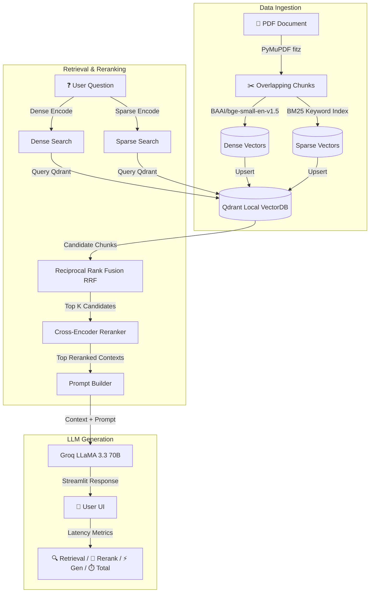

# Production Hybrid Dense-Sparse RAG Pipeline

A production-grade, local Retrieval-Augmented Generation (RAG) system with hybrid dense-sparse search, Cross-Encoder reranking, Groq LLaMA-3.3 acceleration, and UI latency metrics. 

---

## 🏗️ Architecture & Data Flow

This system uses a **Hybrid Search + Rerank** design to achieve high retrieval recall and precision. By combining dense embeddings (which capture semantics) and sparse embeddings (which capture exact keywords), candidates are merged using **Reciprocal Rank Fusion (RRF)** and then prioritized using a **Cross-Encoder Reranker**.



---

## 🛠️ Technology Stack

*   **Frontend UI**: [Streamlit](https://streamlit.io/) — Interactive web application container.
*   **Vector Database**: [Qdrant](https://qdrant.tech/) — Local instance running high-performance vector search.
*   **Embedding Models** (via [FastEmbed](https://qdrant.github.io/fastembed/)):
    *   **Dense**: `BAAI/bge-small-en-v1.5` (384 dimensions)
    *   **Sparse**: `Qdrant/bm25` (term frequency / keyword statistics)
*   **Reranking Model**: `Xenova/ms-marco-MiniLM-L-6-v2` (Cross-Encoder sequence classification).
*   **Text Processing**: [PyMuPDF (fitz)](https://pymupdf.readthedocs.io/) for fast, robust PDF parsing.
*   **LLM API**: [Groq Cloud SDK](https://groq.com/) — Powering LLaMA-3.3-70B-Versatile with sub-second inference speeds.

---

## 📁 Repository Structure

*   [main.py](file:///c:/Users/homeu/Qdrant/main.py) — Main Streamlit application file, page view layouts, sidebar controls, session state storage, and the execution loops.
*   [config.yaml](file:///c:/Users/homeu/Qdrant/config.yaml) — System-wide settings for chunk sizes, model names, local paths, and top-k limits.
*   [.env](file:///c:/Users/homeu/Qdrant/.env) — API keys and configuration credentials.
*   [requirements.txt](file:///c:/Users/homeu/Qdrant/requirements.txt) — Project package requirements.
*   `src/` — Package codebase containing module implementations:
    *   [src/ingestion/loader.py](file:///c:/Users/homeu/Qdrant/src/ingestion/loader.py) — Extracts clean text from uploaded PDFs using PyMuPDF.
    *   [src/chunking/chunker.py](file:///c:/Users/homeu/Qdrant/src/chunking/chunker.py) — Splits text into configured character sizes with overlaps.
    *   [src/embeddings/embedder.py](file:///c:/Users/homeu/Qdrant/src/embeddings/embedder.py) — Handles dual dense-sparse vectorization.
    *   [src/vectordb/vector_store.py](file:///c:/Users/homeu/Qdrant/src/vectordb/vector_store.py) — Interfaces with Qdrant for collections, indexing, storage, and RRF-merged retrieval.
    *   [src/retrieval/retriever.py](file:///c:/Users/homeu/Qdrant/src/retrieval/retriever.py) — Orchestrator connecting embedder query logic to Qdrant vector retrieval.
    *   [src/reranking/reranker.py](file:///c:/Users/homeu/Qdrant/src/reranking/reranker.py) — Re-scores semantic relevance of top candidates using Cross-Encoders.
    *   [src/llm/llm_client.py](file:///c:/Users/homeu/Qdrant/src/llm/llm_client.py) — Invokes Groq completions with factual constraints.
    *   [src/prompts/prompt_templates.py](file:///c:/Users/homeu/Qdrant/src/prompts/prompt_templates.py) — System prompts and templates to prevent hallucinations.

---

## 🚀 Installation & Setup

### 1. Prerequisites
Ensure you have **Python 3.10+** installed on your system.

### 2. Clone and Initialize Virtual Environment
Navigate to the directory and set up a virtual environment:
```bash
# Using standard Python venv
python -m venv .venv
.venv\Scripts\activate

# Or using uv (recommended for speed)
uv venv
.venv\Scripts\activate
```

### 3. Install Dependencies
Install all package configurations:
```bash
# Standard installation
pip install -r requirements.txt

# Or using uv
uv pip install -r requirements.txt
```

### 4. Configure Environment
Create or edit your [.env](file:///c:/Users/homeu/Qdrant/.env) file:
```env
GROQ_API_KEY=gsk_your_actual_groq_api_key_goes_here
```

### 5. Launch the Streamlit App
Start the frontend:
```bash
streamlit run main.py
```
Open your browser and navigate to the local server URL (usually `http://localhost:8501`).

---

## ⚙️ Configuration Tuning

All tunable properties are located inside [config.yaml](file:///c:/Users/homeu/Qdrant/config.yaml):
```yaml
# Embedding models
dense_model: "BAAI/bge-small-en-v1.5"
sparse_model: "Qdrant/bm25"

# Reranker settings
rerank_model: "Xenova/ms-marco-MiniLM-L-6-v2"
rerank_top_k: 3

# Text chunking
chunk_size: 1000
chunk_overlap: 150

# Storage
qdrant_path: "./qdrant_storage"
collection_name: "rag_documents"

# Candidates retrieved before rerank
top_k: 5

# LLM Config
groq_model: "llama-3.3-70b-versatile"
max_tokens: 1024
```

---

## ⏱️ Real-time Performance Tracking

Each RAG response renders individual step metrics directly below the message container:
*   **🔍 Retrieval**: Duration spent fetching dense-sparse indexes from Qdrant.
*   **🎯 Reranking**: Duration spent scoring candidates using Cross-Encoder weights.
*   **⚡ Generation**: Duration spent query-inferencing through Groq LLaMA-3.3.
*   **⏱️ Total**: Combined execution time of the entire retrieval-synthesis turn.

These metrics are saved persistently in `st.session_state` alongside message text, ensuring that when the page re-renders, metrics remain fully intact for previous turns.
